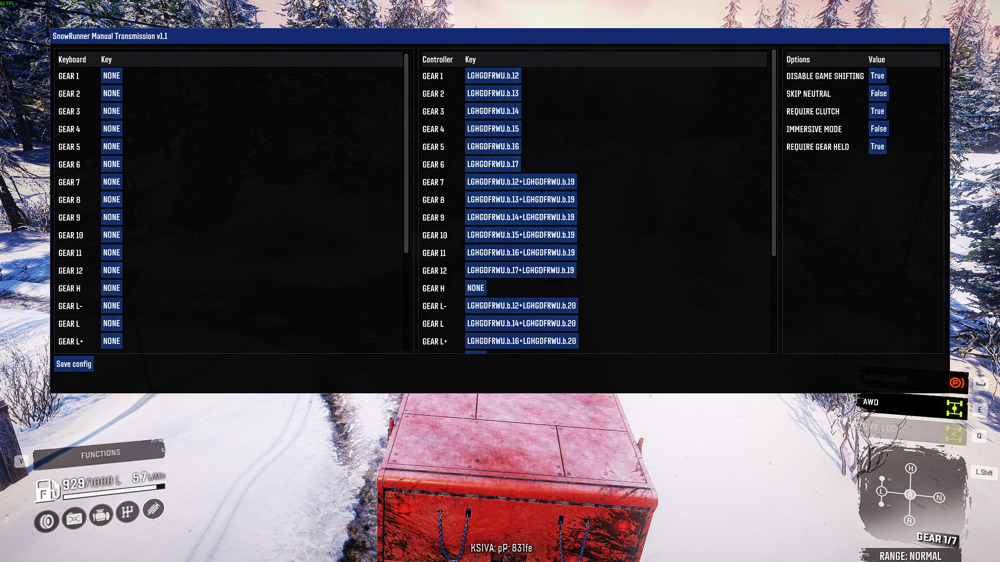

# Snowrunner Manual Transmission

This mod disables SnowRunner's automatic shitbox transmission. \
Shifting can either be done with the game's ui shifter and keybinds to shift up/down in the auto position (IMMERSIVE MODE) or completely with keybinds (DISABLE GAME SHIFTING).

## Installation

1. Get the latest release [here.](https://github.com/drafty46/SMT/releases/latest)
2. Extract files from archive into game folder, next to SnowRunner.exe.
3. The mod will load on game launch.

## Usage

The mod's menu, where all configuration is done, is bound to the home key by default.

 

To change a keybind left click on it's blue box, press the desired key/keys and then right click on the box to confirm. \
To clear an already set keybind right click on it's box. \
Changes take effect immediately but aren't saved unless you use the save button.

## Credits

### [Ferrster](https://github.com/Ferrster) for [Snowrunner-Manual-Gearbox-Mod](https://github.com/Ferrster/Snowrunner-Manual-Gearbox-Mod) - reverse engineered game functions and data structures
### [YAL-Game-Tools](https://github.com/YAL-Game-Tools) for [TinyModInjector](https://github.com/YAL-Game-Tools/TinyModInjector) - dll injector
### [microsoft](https://github.com/microsoft) for [Detours](https://github.com/microsoft/Detours) - library
### [ocornut](https://github.com/ocornut) for [DearImgui](https://github.com/ocornut/imgui) - library
### [Rookfighter](https://github.com/Rookfighter) for [inifile-cpp](https://github.com/Rookfighter/inifile-cpp) - library
### [Rebzzel](https://github.com/Rebzzel) for [kiero](https://github.com/Rebzzel/kiero) - library
### [rdbo](https://github.com/rdbo) for [ImGui-DirectX-11-Kiero-Hook](https://github.com/rdbo/ImGui-DirectX-11-Kiero-Hook) - Imgui+kiero integration
### [wgois](https://github.com/wgois) for [OIS](https://github.com/wgois/OIS) - library
### [Tessil](https://github.com/Tessil) for [ordered-map](https://github.com/Tessil/ordered-map) - library